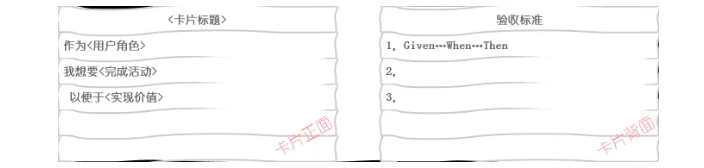

### 第一步，什么是用户故事

### 什么是用户故事

​	用户故事在软件开发过程中被作为描述需求的一种表达形式；为了规范用户故事的表达，便于沟通；包含**角色、活动、价值**三个要素。

#### 1.概念

用户因为什么做什么事情，who,why,what。从需求角度描述就是一个用来确认确认用户和用户需求的简短描述。

用户故事通常的表达格式为：作为一个<用户角色>, 我想要<完成活动>, 以便于<实现价值>。

#### 2.三要素

一个完整的用户故事包含三个要素：

1. 角色（who）：谁要使用这个
2. 活动（what）：要完成什么活动
3. 价值（value）：为什么要这么做，这么做能带来什么价值

### 实行

#### 3.3C原则  传统描述用户信息方式遵循的原则

手写方式  1.卡片 2.对话 3.确认

（1）卡片（Card）：用户故事一般在小卡片上写着故事的简短描述，规则和完成标准。

卡片的正面书写故事的描述，格式为：作为一个<角色>, 我想要<完成活动>, 以便于<实现价值>描述需求；卡片背面书写完成用户故事的规则和完成标准，格式为：Given…When…Then。

（2）交谈（Conversation）：用户故事背后的细节来源于和客户或者产品负责人的交流沟通；确保各方对故事的理解正确

#### 4.INVEST原则

好的用户故事除了格式规范，要素完整外，还应该遵循INVEST原则：Idependent（独立的）；Negotiable（可协商的）；Valuable（有价值的）；Estimatable（可评估）；Small（小的）；Testable（可测试的）。

#### 5.三个准则

用户故事在遵循了INVEST原则后，基本就是一个好的用户故事了。再重点分析三个准则，帮助在产出用户故事时更好地符合原则。

三个准则是：一个用户、完整价值、不依赖。

**（1）重叠依赖**

重叠依赖是带来最多困扰的依赖形式，特别是多个用户故事包含多个不同的重叠部分时，很难找到一组用户故事可以代表该最小可行产品的功能集合，该集合应该包含且仅包含一次需要的功能。

解决方式：

- 将重叠部分单独剥离出来做为独立的用户故事；
- 合理拆分用户故事，并且将重叠部分只保留在一个最有内聚性的用户故事中；
- 使用Scrum开发模式。

**（2）顺序依赖**

顺序依赖是指要使某用户故事完成，另外的一个或多个用户故事必须在它之前完成。顺序依赖通常是无害的，而且有一些方式可以减轻这种依赖。

从敏捷开发的角度，整个系统是从初始的最小可行产品逐步演化为强大的产品，后面的每一步是建立在前面的基础之上的。

但从另外的角度，不必要的顺序依赖使得排列和调整优先级变的比较困难，进而影响制定发布和迭代计划，也使得用户故事的大小估算更难以把握。

解决方式：

- 一个迭代内的用户故事尽量做到没有内在依赖；
- 保持迭代之间只有单向依赖，在时间上只有后面迭代的故事对前面迭代故事的单向依赖（前向依赖）；
- 剥离出核心依赖作为独立的故事，不要把有依赖和无依赖的需求混在一个故事里。

**（3）包含依赖**

包含依赖是指在组织用户故事时使用有层级的管理，比如常见的特性－故事两级管理，一个特性包含多个用户故事，这样就构成了特性对其属下故事的包含依赖。

解决方式：

- 用户故事一级用来做迭代计划，避免用特性一级做粗粒度迭代计划，特性一级可以用来做发布计划；
- 特性一级同样可以进行拆分，直至拆分到最小市场化特性的程度，并将其包含的用户故事分别归到新拆分出的特性中去；
- 遵从最小可行产品的理念，一个特性分多个用户故事多个迭代实现，每一个迭代可形成潜在可交付或者提供内部或外部反馈。