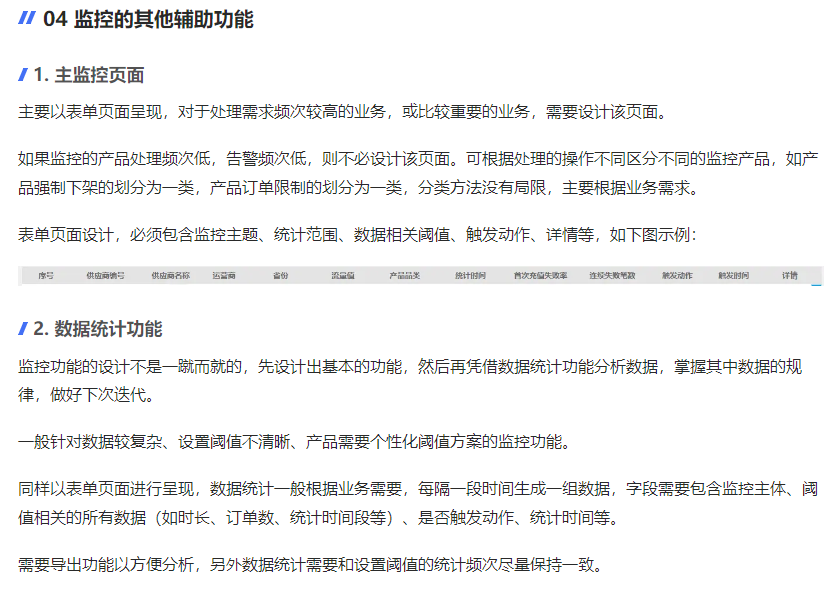
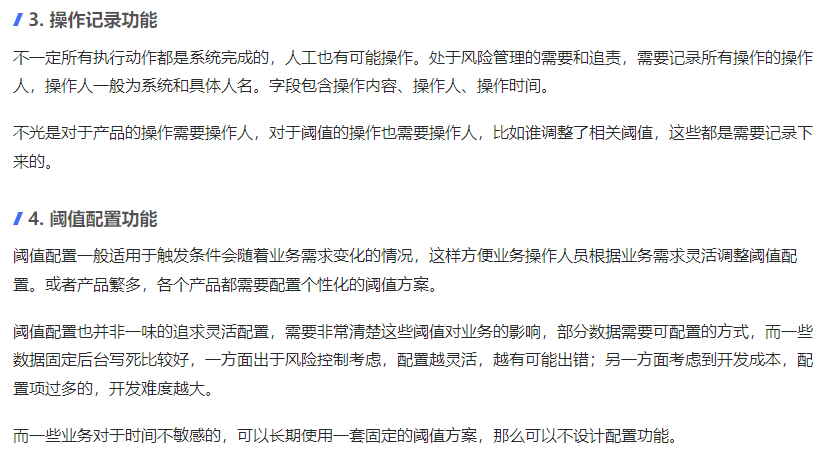
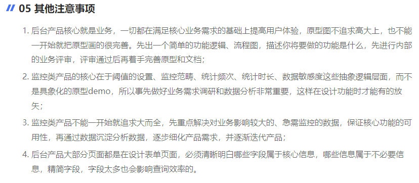

#### 1.什么是监控系统？

监控功能是指针对某项数据或某项业务流程进行系统层面的定时扫描和执行控制措施，旨在定位目标数据中的风险或发现业务流程中的问题，并通过系统采取必要的自动化控制手段并沉淀相关数据。

监控功能是后台系统中的轻量级应用，一般较多的涉及数据、逻辑层面，较少的涉及界面原型设计。

#### 2.为什么需要监控系统？

1.监控与业务目标相关的核心指标，从数据中获取价值。

2.对影响核心指标的数据进行监控，以便快速定位问题所在，减少损失，影响范围减到最低。

#### 3.监控的核心要素

监控的核心要素为监控的**对象及其限定条件**，监控的**时间范围**或监控的**数量级**，系统执行的**时间和频次**，触发条件，处理机制。

##### 1. 监控对象及其限定条件

如果监控对象是某项复杂业务流程，那必须明确说明选取对象的规则。

##### 2. 监控的时间范围或数量级

根据不同业务的数据量级不同，选择合适的监控时间范围

##### 3. 系统执行的时间和频次

系统执行时间一般有：

1. 设置固定时间点执行；
2. 设置固定的间隔时间执行。

选择1意味着业务流程，可能含有更多人工干涉的因素；或者系统在执行其他程序时与此程序有些不兼容的问题，比如前置条件和后置条件，为防止程序产生冲突，设置固定的时间点执行。

选择2则意味着业务数据在时间分布上是均匀的。

间隔时间的设置跟业务的响应时间成正比，业务越需要快速响应的，执行的频次越高。如利润属于公司核心指标，出现亏损是不可接受的，所以响应时间要尽可能快，间隔时间可设置为5分钟或10分钟执行一次。

即使选择了按照固定频次执行，也不意味着万事大吉。产品人员还需要与技术协商好该程序几点开始执行，执行一次的时间大概是多少秒，执行程序是否会对关联数据产生影响。

##### 4. 触发条件

监控既然是对业务中风险进行控制，那么必然需要有响应的触发条件。

触发条件主要依赖于阈值的设置，通过阈值的灵活设置，可以让业务部门随时根据业务情况自行配置相关阈值。

##### 5.处理机制

处理机制一般为告警和系统自动执行。

**（1） 告警按照问题出现的严重程度，采取不同的告警措施：**

1. 数据波动幅度较大，情况紧急，设置电话通知的告警方式，保证消息及时收到，业务人员可以及时处理（即使在非工作日遇到紧急情况也能迅速处理）；
2. 数据波动幅度一般，对于时间要求较宽松的，采用短信通知的告警方式，业务人员看到后处理即可；
3. 数据波动较小，处理或不处理影响不大的，或仅做通知用途的，可采用系统推送消息的方式告警。如果是日常运营内容，如工单的处理、审核等（数据量小，频次不高的情况），也可采用系统推送的方式。

当对某项业务数据进行告警时，告警信息务必明清晰告警内容主体，告警相关数据，该主体对应设置的阈值，便于第一时间明确问题出现的层次和范围，查找更深层次的原因并进行控制。

**（2） 另外一种处理机制是系统强制执行，控制目标产品下架、强制关闭某功能。**

一般为达到止损或减损的目的，通常配合告警信息同步使用，一方面起到通知的作用，另一方面便于后续查找问题。

所有的超过阈值和相关处理措施都应该形成日志记录，如需要后续迭代和分析数据的，则需要形成完整和规范的数据报表，并且需要导出功能。

